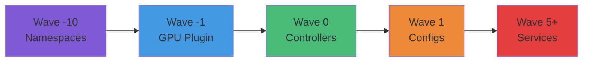
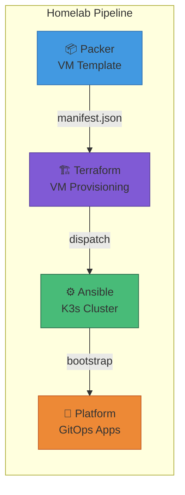

# Homelab Platform


[](https://k3s.io)


GitOps repository for managing a Kubernetes homelab using ArgoCD with an App-of-Apps pattern. All cluster applications are defined declaratively and automatically synced from this repository.

## Overview

This repository contains the complete application layer for the homelab Kubernetes cluster. It is bootstrapped by [homelab-ansible](https://github.com/starktastic/homelab-ansible) and uses ArgoCD for continuous deployment.

```mermaid
flowchart TB
    subgraph Bootstrap["ArgoCD Bootstrap"]
        ClusterBootstrap[cluster-bootstrap] --> Foundation
        ClusterBootstrap --> InfraConfigs
        ClusterBootstrap --> AppSet
    end
    
    subgraph Apps["Applications"]
        Foundation[foundation<br/>wave: -10] --> Namespaces[Namespaces]
        AppSet[platform AppSet<br/>wave: 0-5] --> Controllers
        AppSet --> Services
        InfraConfigs[infra-configs<br/>wave: 1] --> Ingresses
        
        subgraph Controllers["Infrastructure"]
            Traefik[Traefik]
            Authentik[Authentik]
            PostgreSQL[PostgreSQL]
            Redis[Redis]
        end
        
        subgraph Services["Services"]
            Media[Media Apps]
            Operations[Operations]
        end
        
        subgraph Ingresses["Configs"]
            Routes[IngressRoutes]
            Certs[Certificates]
            MW[Middlewares]
        end
    end
    
    style Bootstrap fill:#2d3748,stroke:#805ad5
    style Apps fill:#2d3748,stroke:#48bb78
```



## Features

- 🔄 **GitOps with ArgoCD** - Declarative app definitions, auto-sync, self-healing
- 📦 **App-of-Apps Pattern** - Unified ApplicationSet for all workloads
- 🔐 **Authentik SSO** - OIDC authentication with ForwardAuth middleware
- 🌐 **Traefik Ingress** - Dynamic IngressRoute generation
- 🔑 **Sealed Secrets** - Encrypted secrets stored in Git
- 🎮 **Intel GPU Support** - SR-IOV passthrough for transcoding
- 💾 **NFS Storage** - Dynamic provisioning with `nfs-pv` StorageClass
- 🔄 **Renovate Managed** - Automated Helm chart updates

## Architecture

```mermaid
flowchart LR
    subgraph External["External Traffic"]
        Public["*.starktastic.net<br/>10.9.8.90"]
        Media["*.benplus.app<br/>10.9.8.90"]
    end
    
    subgraph Internal["Internal Traffic"]
        Int["*.internal.starktastic.net<br/>10.9.9.90"]
    end
    
    subgraph Cluster["K3s Cluster"]
        Traefik[Traefik]
        Authentik[Authentik<br/>ForwardAuth]
        Apps[Applications]
    end
    
    Public --> Traefik
    Media --> Traefik
    Int --> Traefik
    Traefik --> Authentik
    Authentik --> Apps
    Traefik --> Apps
    
    style External fill:#e53e3e,stroke:#c53030
    style Internal fill:#4299e1,stroke:#2b6cb0
    style Cluster fill:#2d3748,stroke:#48bb78
```



## Repository Structure

```
apps/
├── bootstrap/                  # Entry point - deploy these first
│   ├── foundation.yaml         # Creates namespaces (sync-wave: -10)
│   ├── infra-configs.yaml      # Deploys configs after controllers (wave: 1)
│   └── appsets/
│       └── platform.yaml       # Unified ApplicationSet
│
├── foundation/                 # Namespace definitions
│   └── namespaces/
│       ├── authentik.yaml
│       ├── cert-manager.yaml
│       └── ...
│
├── infrastructure/
│   ├── configs/                # Non-Helm resources
│   │   └── ingresses/          # IngressRoutes, certs, middlewares
│   ├── controllers/            # Helm-based infrastructure
│   │   ├── authentik/          # Identity provider
│   │   ├── databases/          # PostgreSQL + Redis
│   │   └── traefik/            # Ingress controller
│   └── system/                 # Cluster components
│       ├── cert-manager/
│       ├── intel-gpu/
│       ├── nfs-provisioner/
│       └── sealed-secrets/
│
├── services/                   # User-facing applications
│   ├── media/                  # qBittorrent, Prowlarr
│   └── operations/             # ntfy
│
├── templates/
│   ├── common.yaml             # Shared values for services
│   ├── infra-common.yaml       # Shared values for infrastructure
│   └── ingress-chart/          # Dynamic IngressRoute generator
│
└── scripts/
    ├── new-service.sh          # Scaffold a new service
    ├── seal.sh                 # Seal secrets with kubeseal
    └── dyff-wrapper.sh         # YAML diff for CI
```

## Bootstrap Order

Deployment follows strict sync-wave ordering:



| Wave | Component | Description |
|------|-----------|-------------|
| -10 | `foundation` | Namespaces and basic RBAC |
| -1 | `intel-gpu-plugin` | GPU device plugin (before workloads) |
| 0 | Infrastructure controllers | Traefik, Authentik, PostgreSQL, Redis |
| 1 | `infra-configs` | Ingress routes, certificates, middlewares |
| 5+ | Services | User applications |

## Infrastructure Components

### Controllers

| Component | Chart Version | Description |
|-----------|--------------|-------------|
| Traefik | v39.0.0 | Ingress controller with dual entrypoints |
| Authentik | v2025.12.3 | Identity provider with OIDC SSO |
| PostgreSQL | v18.2.4 | Database for Authentik and apps |
| Redis | v24.1.3 | Cache for Authentik |

### System

| Component | Description |
|-----------|-------------|
| cert-manager | TLS certificate automation |
| intel-device-operator | Intel GPU device management |
| intel-gpu-plugin | Exposes GPU resources to pods |
| nfs-provisioner | Dynamic NFS volume provisioning |
| sealed-secrets | Encrypted secrets in Git |

## Domain Configuration

| Domain | Purpose | LoadBalancer IP | Entrypoint |
|--------|---------|-----------------|------------|
| `*.starktastic.net` | Public services | `10.9.8.90` | `websecure` |
| `*.internal.starktastic.net` | Internal services | `10.9.9.90` | `websec-int` |
| `*.benplus.app` | Media services | `10.9.8.90` | `websecure` |

## Usage

### Adding a New Service

1. Create directory: `apps/services/<category>/<name>/`
2. Add `app.yaml`:
   ```yaml
   name: my-service
   namespace: my-namespace
   syncWave: "5"
   
   ingress:
     enabled: true
     host: my-service          # Subdomain
     domainType: "internal"    # public | internal | media
     port: 8080
     auth: true                # Authentik ForwardAuth
     rateLimit: true           # Rate limiting
   ```
3. Add `values.yaml` (extends `templates/common.yaml`)
4. Add `manifests/` folder for PVCs and extra resources

Or use the scaffolding script:
```bash
./scripts/new-service.sh
```

### Sealing Secrets

```bash
# Namespace-scoped (default)
./scripts/seal.sh <secret-name> <namespace>

# Cluster-wide scope
./scripts/seal.sh <secret-name> <namespace> --cluster-wide
```

### Shared Defaults

All services inherit from `templates/common.yaml`:

```yaml
global:
  storageClass: "nfs-pv"
  domains:
    public: "starktastic.net"
    internal: "internal.starktastic.net"
    media: "benplus.app"

controllers:
  main:
    containers:
      main:
        env:
          TZ: "Asia/Jerusalem"
          PUID: "1000"
          PGID: "1000"

persistence:
  config:
    enabled: true
    storageClass: "nfs-pv"
    size: 1Gi
```

## GPU Support

Intel GPU passthrough for hardware transcoding:

```yaml
controllers:
  main:
    containers:
      main:
        resources:
          requests:
            gpu.intel.com/i915: "1"
          limits:
            gpu.intel.com/i915: "1"
```

## Network Configuration

| Service | IP Address | Purpose |
|---------|------------|---------|
| NFS Server | `10.9.8.30` | Persistent storage |
| Traefik External | `10.9.8.90` | Public ingress |
| Traefik Internal | `10.9.9.90` | Internal ingress |
| qBittorrent | `10.9.8.91` | BitTorrent client |

### VLANs

| VLAN | CIDR | Purpose |
|------|------|---------|
| Management | `10.9.9.0/24` | Cluster management |
| Services | `10.9.8.0/24` | Service network |
| Pods | `10.42.0.0/16` | Kubernetes pods |

## Pipeline Integration



## Troubleshooting

| Issue | Solution |
|-------|----------|
| PostgreSQL postmaster.pid lock | Init container auto-removes stale locks |
| Sealed secrets decryption error | Verify secret was sealed for correct namespace |
| Sync wave ordering failure | Check namespaces exist (wave -10) before controllers |
| PVC stuck in Pending | Verify NFS server `10.9.8.30` is accessible |
| GPU not available | Check intel-gpu-plugin pods are running |

## Related Repositories

| Repository | Description |
|------------|-------------|
| [homelab-packer](https://github.com/starktastic/homelab-packer) | Builds VM templates |
| [homelab-terraform](https://github.com/starktastic/homelab-terraform) | Provisions VMs on Proxmox |
| [homelab-ansible](https://github.com/starktastic/homelab-ansible) | K3s cluster configuration |

## License

MIT
