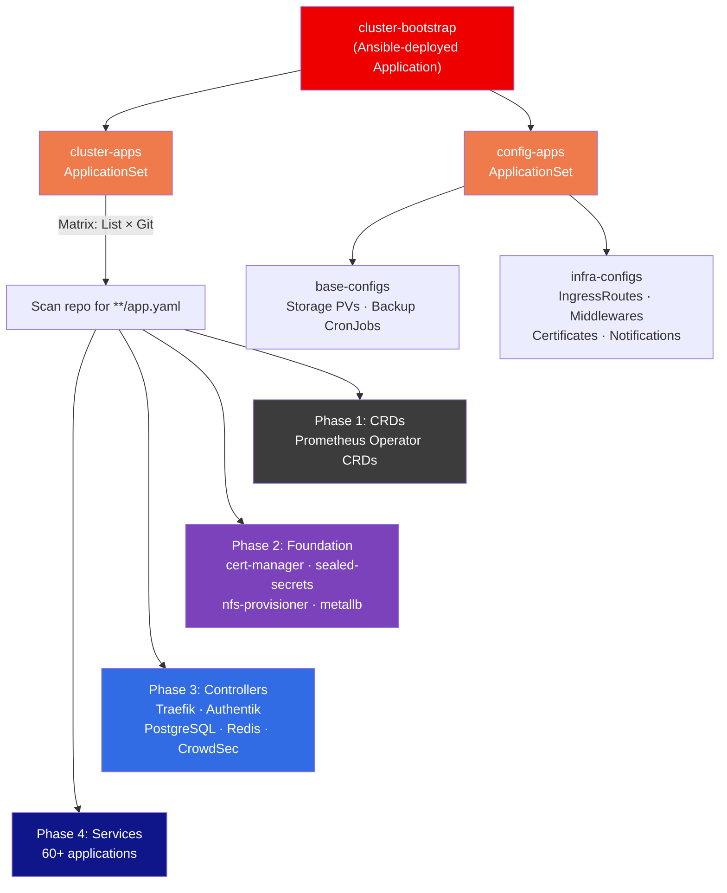
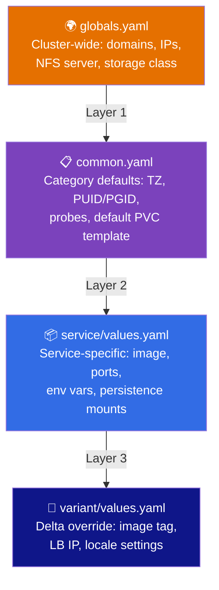
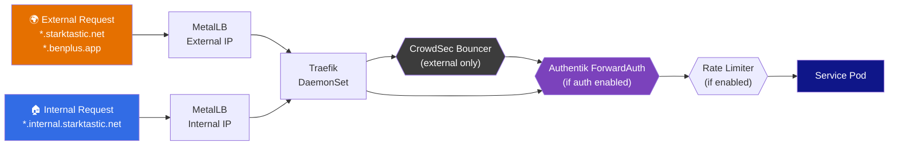
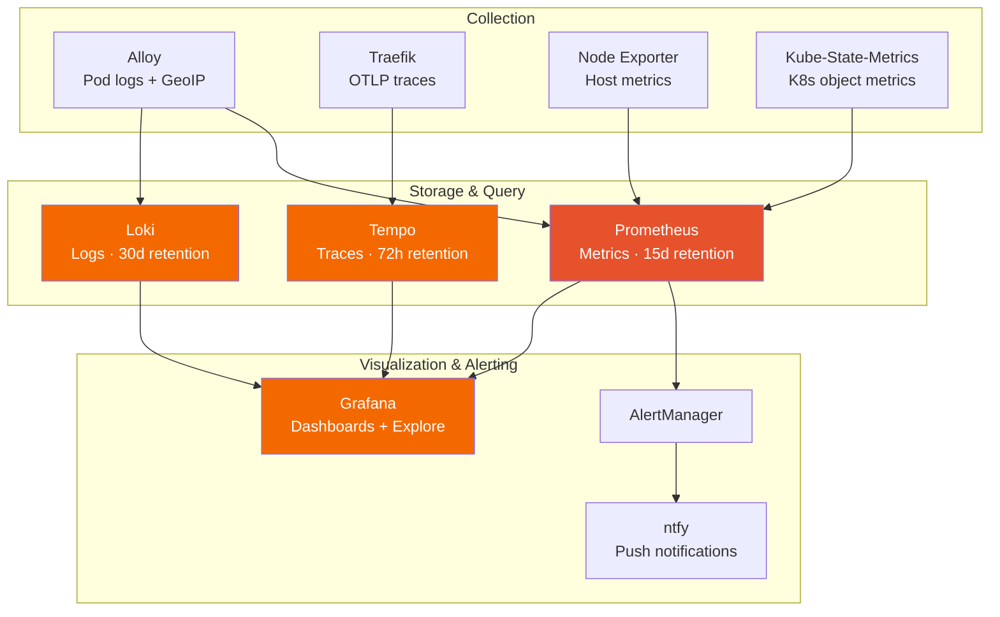
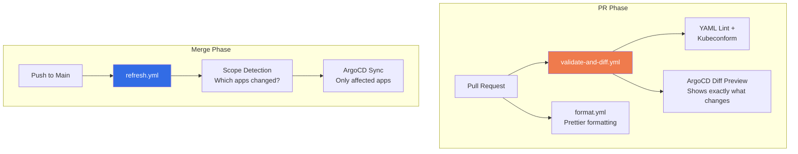

<div align="center">

# ☸️ Apps — Kubernetes Application Platform

**GitOps-driven application deployment with ArgoCD, phased rollouts, and 60+ self-hosted services**

[](https://argoproj.github.io/cd/)
[](https://helm.sh/)
[](https://kubernetes.io/)
[](https://traefik.io/)

*A single Git repo that defines the entire application layer — from infrastructure controllers to user-facing services*

</div>

---

## Table of Contents

- [Overview](#overview)
- [GitOps Architecture](#gitops-architecture)
- [Value Cascade Design](#value-cascade-design)
- [Infrastructure Layers](#infrastructure-layers)
- [Service Categories](#service-categories)
- [Traffic Flow](#traffic-flow)
- [Observability](#observability)
- [Key Design Patterns](#key-design-patterns)
- [Helper Scripts](#helper-scripts)
- [CI/CD Automation](#cicd-automation)
- [Prerequisites](#prerequisites)
- [Adding a New Service](#adding-a-new-service)
- [License \& Contributing](#license--contributing)

---

## Overview

This repository is the **single source of truth** for everything running on the K3s cluster. ArgoCD watches this repo and continuously reconciles the desired state defined here with the live cluster. The architecture features:

- **Automatic service discovery** — drop an `app.yaml` file, ArgoCD picks it up
- **4-phase ordered deployment** — CRDs before controllers, controllers before services
- **Cascading value hierarchy** — change a domain or IP once, it propagates to every service
- **Base/variant inheritance** — language or regional variants share 95% of their config with the base service
- **Sealed Secrets in Git** — encrypted secrets committed alongside manifests, decrypted in-cluster

The repo manages infrastructure controllers (Traefik, Authentik, cert-manager, databases), observability (Prometheus, Grafana, Loki, Tempo), and 60+ user-facing applications across home automation, media, and operations categories.

---

## GitOps Architecture

### ApplicationSet Discovery

Two ApplicationSets at the bootstrap level drive all deployments:


```mermaid
flowchart TB
    BOOT["cluster-bootstrap\n(Ansible-deployed Application)"]
    BOOT --> CS["cluster-apps\nApplicationSet"]
    BOOT --> CFG["config-apps\nApplicationSet"]

    CS -->|"Matrix: List × Git"| DISCOVER["Scan repo for **/app.yaml"]

    DISCOVER --> P1["Phase 1: CRDs\nPrometheus Operator CRDs"]
    DISCOVER --> P2["Phase 2: Foundation\ncert-manager · sealed-secrets\nnfs-provisioner · metallb"]
    DISCOVER --> P3["Phase 3: Controllers\nTraefik · Authentik\nPostgreSQL · Redis · CrowdSec"]
    DISCOVER --> P4["Phase 4: Services\n60+ applications"]

    CFG --> BC["base-configs\nStorage PVs · Backup CronJobs"]
    CFG --> IC["infra-configs\nIngressRoutes · Middlewares\nCertificates · Notifications"]

    P1 ~~~ P2 ~~~ P3 ~~~ P4

    style BOOT fill:#EE0000,color:#fff
    style CS fill:#EF7B4D,color:#fff
    style CFG fill:#EF7B4D,color:#fff
    style P1 fill:#3C3C3C,color:#fff
    style P2 fill:#7B42BC,color:#fff
    style P3 fill:#326CE5,color:#fff
    style P4 fill:#0F1689,color:#fff
```

The **Matrix generator** combines a list of categories (infrastructure, services) with a Git file scanner. Every directory containing an `app.yaml` is automatically discovered and deployed — no manual Application manifests needed.

### Phased RollingSync

Deployments are ordered through 4 phases to guarantee dependency resolution:

| Phase | Label | What Deploys | Why It's First |
|-------|-------|-------------|----------------|
| 1 | `crds` | Prometheus Operator CRDs | CRDs must exist before any ServiceMonitor/PodMonitor |
| 2 | `foundation` | cert-manager, sealed-secrets, NFS, MetalLB | TLS, secrets, storage, and load balancing are prerequisites |
| 3 | `controllers` | Traefik, Authentik, databases, CrowdSec, Intel GPU | Ingress, auth, and data layers must be ready for services |
| 4 | `services` | All user-facing applications | Everything they depend on is guaranteed available |

Each phase completes fully before the next begins, ensuring clean bootstrap even on a fresh cluster.

---

## Value Cascade Design

Every Helm release inherits configuration from a strict 4-layer hierarchy — maximizing reuse and minimizing duplication:


```mermaid
flowchart TB
    G["🌍 globals.yaml\nCluster-wide: domains, IPs,\nNFS server, storage class"]
    C["📋 common.yaml\nCategory defaults: TZ, PUID/PGID,\nprobes, default PVC template"]
    S["📦 service/values.yaml\nService-specific: image, ports,\nenv vars, persistence mounts"]
    V["🔀 variant/values.yaml\nDelta override: image tag,\nLB IP, locale settings"]

    G -->|"Layer 1"| C
    C -->|"Layer 2"| S
    S -->|"Layer 3"| V

    style G fill:#E57000,color:#fff
    style C fill:#7B42BC,color:#fff
    style S fill:#326CE5,color:#fff
    style V fill:#0F1689,color:#fff
```

| Layer | Scope | Example |
|-------|-------|---------|
| **globals.yaml** | Every release in the cluster | Domains, NFS server IP, MetalLB pool IPs, default storage class |
| **common.yaml** | All services in a category | Timezone, PUID/PGID, liveness/readiness probes, NFS PVC template |
| **values.yaml** | Single service | Container image, port mappings, environment variables, mount paths |
| **variant values** | Override layer (optional) | Image tag override, alternate LoadBalancer IP, locale-specific settings |

**Impact**: Changing the NFS server IP in `globals.yaml` automatically propagates to every service using NFS storage on the next sync — zero individual edits.

---

## Infrastructure Layers

The infrastructure is organized into four tiers, deployed in order:

```
infrastructure/
├── system/              Phase 2 (Foundation)
│   ├── cert-manager         TLS automation (Let's Encrypt + Cloudflare DNS-01)
│   ├── sealed-secrets       In-cluster secret decryption
│   ├── nfs-provisioner      Dynamic PV provisioning from TrueNAS
│   ├── metallb              L2 load balancer (multiple IP pools)
│   ├── intel-device-operator GPU scheduling (SR-IOV virtual functions)
│   ├── crowdsec             Intrusion detection with mTLS
│   └── prometheus-crds      Phase 1 — CRD-only (no Prometheus yet)
│
├── controllers/         Phase 3 (Controllers)
│   ├── traefik              DaemonSet ingress with CrowdSec bouncer
│   ├── authentik            SSO provider (OIDC, LDAP, ForwardAuth)
│   └── databases            PostgreSQL + Redis (shared by services)
│
├── configs/             Phase 3-4 (Configuration)
│   └── templates/           IngressRoutes, middlewares, certs, notifications
│
└── base-configs/        Phase 2 (Foundation)
    └── templates/           Storage PVs, backup CronJobs (PostgreSQL, TLS certs)
```

---

## Service Categories

Services are organized into three domains. Each service is self-contained in its own directory with an `app.yaml` and `values.yaml`:

### 🏠 Home Automation

Smart home infrastructure including a home automation platform, MQTT broker, and Zigbee coordinator bridge — working together for IoT device management across the local network.

### 🎬 Media

A comprehensive media management ecosystem covering acquisition, organization, streaming, and discovery — with GPU-accelerated transcoding and multi-language support via base/variant service pairs.

### 🔧 Operations

The operational backbone: full observability stack (metrics, logs, traces, dashboards, alerting), document management, password vault, push notifications, and a collection of self-hosted productivity tools.

> Services are intentionally described by category rather than enumerated individually — the lineup evolves continuously as services are added, removed, or upgraded.

---

## Traffic Flow

All external and internal traffic follows a layered security path:


```mermaid
flowchart LR
    EXT["🌍 External Request\n*.starktastic.net\n*.benplus.app"]
    INT["🏠 Internal Request\n*.internal.starktastic.net"]

    EXT --> LB_EXT["MetalLB\nExternal IP"]
    INT --> LB_INT["MetalLB\nInternal IP"]

    LB_EXT --> TFK["Traefik\nDaemonSet"]
    LB_INT --> TFK

    TFK --> CS{{"CrowdSec Bouncer\n(external only)"}}
    CS --> AUTH{{"Authentik ForwardAuth\n(if auth enabled)"}}
    TFK --> AUTH
    AUTH --> RL{{"Rate Limiter\n(if enabled)"}}
    RL --> SVC["Service Pod"]

    style EXT fill:#E57000,color:#fff
    style INT fill:#326CE5,color:#fff
    style CS fill:#3C3C3C,color:#fff
    style AUTH fill:#7B42BC,color:#fff
    style SVC fill:#0F1689,color:#fff
```

| Layer | Scope | Function |
|-------|-------|----------|
| **MetalLB** | All traffic | L2 load balancing to Traefik DaemonSet pods |
| **Traefik** | All traffic | TLS termination, IngressRoute routing |
| **CrowdSec** | External only | Bot detection, IP reputation, rate limiting |
| **Authentik** | Per-service opt-in | OIDC/ForwardAuth SSO with group-based access |
| **Rate Limiter** | Per-service opt-in | Request throttling (configurable per route) |

---

## Observability

A full observability stack provides metrics, logs, traces, and alerting:


```mermaid
flowchart TB
    subgraph collection["Collection"]
        ALLOY["Alloy\nPod logs + GeoIP"]
        TFK_TRACE["Traefik\nOTLP traces"]
        NE["Node Exporter\nHost metrics"]
        KSM["Kube-State-Metrics\nK8s object metrics"]
    end

    subgraph storage["Storage & Query"]
        PROM["Prometheus\nMetrics · 15d retention"]
        LOKI["Loki\nLogs · 30d retention"]
        TEMPO["Tempo\nTraces · 72h retention"]
    end

    subgraph viz["Visualization & Alerting"]
        GRAF["Grafana\nDashboards + Explore"]
        AM["AlertManager"]
        NTFY["ntfy\nPush notifications"]
    end

    ALLOY --> LOKI
    ALLOY --> PROM
    TFK_TRACE --> TEMPO
    NE --> PROM
    KSM --> PROM

    PROM --> GRAF
    LOKI --> GRAF
    TEMPO --> GRAF
    PROM --> AM
    AM --> NTFY

    style GRAF fill:#F46800,color:#fff
    style PROM fill:#E6522C,color:#fff
    style LOKI fill:#F46800,color:#fff
    style TEMPO fill:#F46800,color:#fff
```

---

## Key Design Patterns

### 1. Automatic Service Discovery
Drop an `app.yaml` file anywhere in the repo — the Matrix generator finds it and creates an ArgoCD Application. No boilerplate Application manifests to maintain.

### 2. Base/Variant Inheritance
Language variants (e.g., a Russian-language media manager) point to a base service via `baseApp` and only override what differs. A variant is typically 3-5 lines of YAML rather than duplicating an entire service config.

### 3. Ingress Chart Abstraction
A custom Helm chart generates Traefik IngressRoutes from declarative `app.yaml` fields. One line (`auth: true`) wires up Authentik ForwardAuth, TLS, and CrowdSec — no per-service IngressRoute YAML to maintain.

### 4. Pre-fetched CrowdSec Bouncer
Traefik's CrowdSec bouncer plugin is downloaded via init container to emptyDir, not fetched at runtime. This ensures cluster restarts work even if GitHub is down.

### 5. Sealed Secrets Workflow
Secrets are encrypted with a pre-seeded certificate (matching the Ansible bootstrap), committed to Git as `SealedSecret` CRDs, and decrypted in-cluster. The `seal.sh` helper script wraps the entire workflow.

### 6. Multi-Source Helm Rendering
Each ArgoCD Application pulls from up to 4 sources: the Helm chart repo, the Git values layers, the ingress chart, and raw manifests — composing complex deployments declaratively.

---

## Helper Scripts

| Script | Purpose |
|--------|---------|
| `scripts/new-service.sh` | Interactive scaffolding — prompts for image, ingress, persistence and generates `app.yaml` + `values.yaml` |
| `scripts/seal.sh` | Encrypts secrets into SealedSecret YAML using the cluster's pre-seeded certificate |
| `scripts/get-kubeconfig.sh` | Fetches kubeconfig from the control plane and patches the server IP |
| `scripts/ntfy-manager.sh` | CLI wrapper for managing ntfy users and access rules inside the running pod |

---

## CI/CD Automation

Three workflows ensure safe, validated deployments:


```mermaid
flowchart TD
    subgraph "PR Phase"
        PR["Pull Request"] --> VAL["validate-and-diff.yml"]
        VAL --> LINT["YAML Lint +\nKubeconform"]
        VAL --> DIFF["ArgoCD Diff Preview\nShows exactly what changes"]
        PR --> FMT["format.yml\nPrettier formatting"]
    end

    subgraph "Merge Phase"
        MERGE["Push to Main"] --> REF["refresh.yml"]
        REF --> SCOPE["Scope Detection\nWhich apps changed?"]
        SCOPE --> SYNC["ArgoCD Sync\nOnly affected apps"]
    end

    style VAL fill:#EF7B4D,color:#fff
    style REF fill:#326CE5,color:#fff
```

| Workflow | Trigger | Purpose |
|----------|---------|---------|
| **validate-and-diff** | PR | YAML lint + Kubeconform schema validation + ArgoCD diff preview |
| **format** | PR | Prettier formatting for YAML/JSON/shell files |
| **refresh** | Push to main | Smart scope detection — only syncs ArgoCD apps affected by the change |

The refresh workflow is **scope-aware**: it analyzes the git diff to determine whether to refresh all apps, all services, all infrastructure, or just specific applications — avoiding unnecessary reconciliation cycles.

---

## Prerequisites

- **K3s cluster** provisioned by the Ansible playbook (with ArgoCD bootstrapped)
- **kubeseal** CLI + sealed-secrets certificate for secret encryption
- **kubectl** configured with cluster access
- **yq** and **crane** (for `new-service.sh` scaffolding script)

---

## Adding a New Service

```bash
# Interactive scaffolding
./scripts/new-service.sh

# Or manually create:
# services/<category>/<service-name>/app.yaml
# services/<category>/<service-name>/values.yaml

# Encrypt any secrets
./scripts/seal.sh <secret-name> <namespace>

# Commit and push — ArgoCD discovers and deploys automatically
git add . && git commit -m "feat: add <service>" && git push
```

The ApplicationSet will discover the new `app.yaml` on the next sync cycle and create an ArgoCD Application for it automatically.

---

## License & Contributing

This is a personal homelab project. Feel free to use it as inspiration for your own infrastructure. If you spot an issue or have a suggestion, [open an issue](../../issues) — contributions and feedback are welcome.
