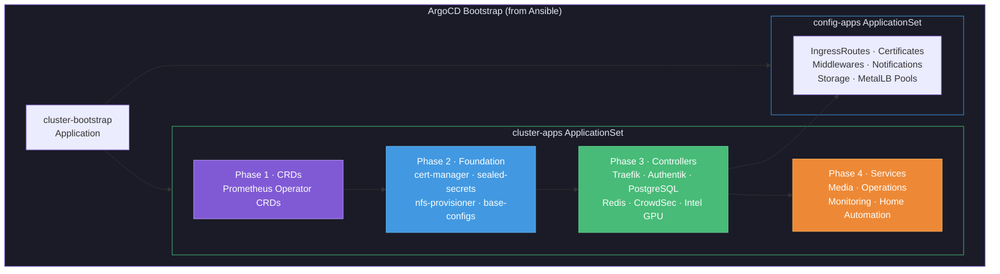
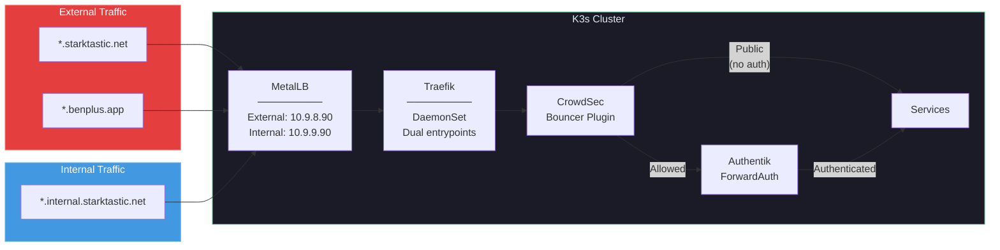
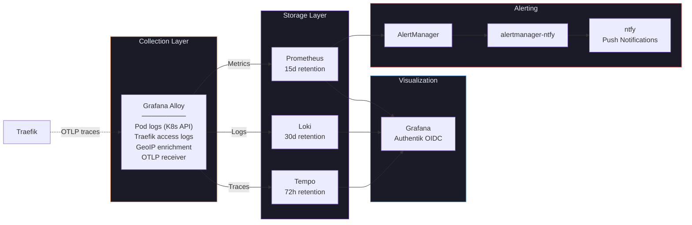
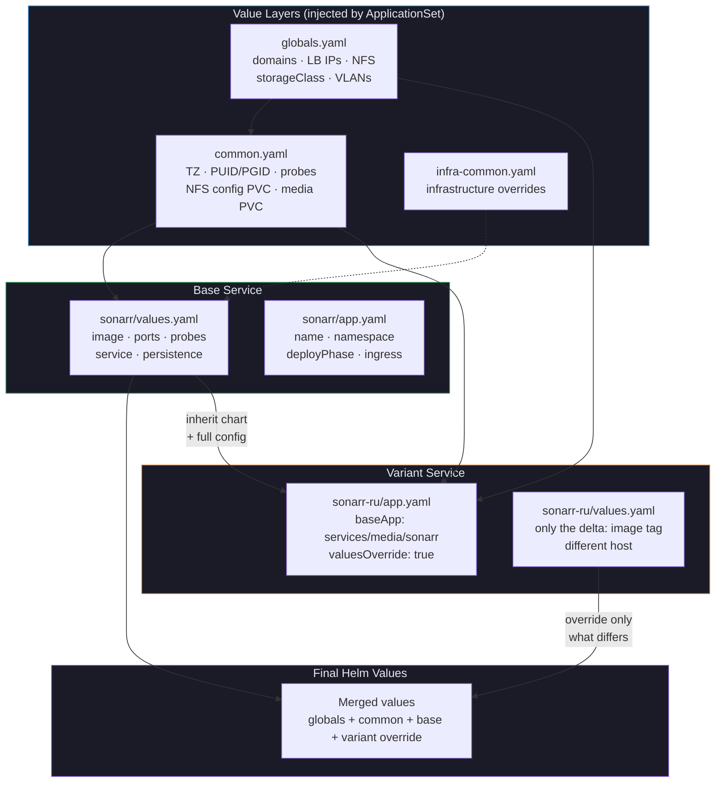
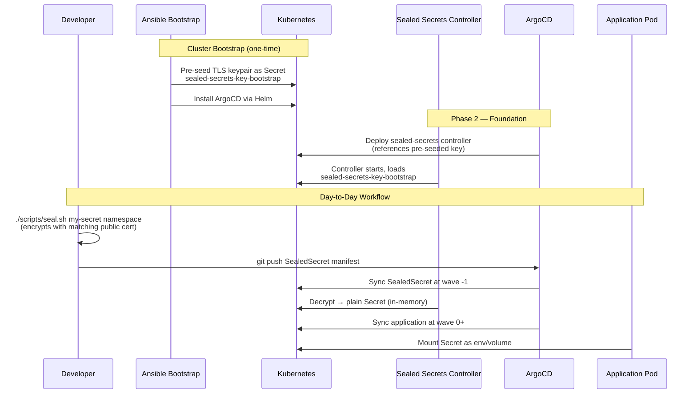

# Homelab Apps

[](https://github.com/Starktastic-Homelab/apps/actions/workflows/validate-and-diff.yml)


Declarative GitOps repository powering a Kubernetes homelab — ArgoCD ApplicationSets, phased rollouts, Traefik ingress with CrowdSec and Authentik SSO, full observability stack, Intel SR-IOV GPU transcoding, and a growing collection of self-hosted services deployed entirely from Git.

## Overview

This is the final stage of the [Starktastic Homelab](https://github.com/Starktastic-Homelab) pipeline. Bootstrapped by [Ansible](https://github.com/Starktastic-Homelab/ansible) via a single App-of-Apps `Application`, ArgoCD takes over and continuously reconciles every resource in this repository to the live cluster. Infrastructure components, ingress configuration, and all services are defined declaratively — a push to `main` is a deployment.


```mermaid
flowchart TB
    subgraph bootstrap["ArgoCD Bootstrap (from Ansible)"]
        App["cluster-bootstrap\nApplication"] --> AppSets
        App --> ConfigSets
    end

    subgraph AppSets["cluster-apps ApplicationSet"]
        direction TB
        P1["Phase 1 · CRDs\nPrometheus Operator CRDs"]
        P2["Phase 2 · Foundation\ncert-manager · sealed-secrets\nnfs-provisioner · base-configs"]
        P3["Phase 3 · Controllers\nTraefik · Authentik · PostgreSQL\nRedis · CrowdSec · Intel GPU"]
        P4["Phase 4 · Services\nMedia · Operations\nMonitoring · Home Automation"]
        P1 --> P2 --> P3 --> P4
    end

    subgraph ConfigSets["config-apps ApplicationSet"]
        Configs["IngressRoutes · Certificates\nMiddlewares · Notifications\nStorage · MetalLB Pools"]
    end

    P3 --> Configs

    style bootstrap fill:#1a1b27,stroke:#805ad5,color:#e2e8f0
    style AppSets fill:#1a1b27,stroke:#48bb78,color:#e2e8f0
    style ConfigSets fill:#1a1b27,stroke:#4299e1,color:#e2e8f0
    style P1 fill:#805ad5,stroke:#b794f4,color:#fff
    style P2 fill:#4299e1,stroke:#63b3ed,color:#fff
    style P3 fill:#48bb78,stroke:#68d391,color:#fff
    style P4 fill:#ed8936,stroke:#f6ad55,color:#fff
```

## Features

- **GitOps with ArgoCD** — Declarative definitions, automated sync, self-healing, pruning
- **Phased RollingSync** — 4-phase deployment ordering (CRDs → Foundation → Controllers → Services)
- **ApplicationSet Matrix Generator** — Discovers services by scanning for `app.yaml` files in Git
- **Authentik SSO** — OIDC ForwardAuth middleware on Traefik for single sign-on across services
- **CrowdSec Bouncer** — Traefik plugin for intrusion detection with mutual TLS to LAPI
- **Sealed Secrets** — Encrypted secrets committed to Git, decrypted in-cluster with pre-seeded keys
- **Intel SR-IOV GPU** — Hardware transcoding via `gpu.intel.com/i915` resource requests
- **Full Observability** — Prometheus + Grafana + Loki + Tempo + Alloy pipeline with ntfy alerting
- **Dynamic NFS Storage** — `nfs-pv` StorageClass backed by TrueNAS
- **Shared Templates** — `globals.yaml` and `common.yaml` inject defaults into every service
- **Ingress Chart** — Custom Helm chart generates Traefik IngressRoutes from simple `app.yaml` declarations
- **Renovate Managed** — Helm charts, container images, and plugin versions auto-updated via PRs
- **ArgoCD Diff on PRs** — CI validates YAML, runs Kubeconform, and previews ArgoCD diffs before merge
- **Smart Refresh** — Post-merge workflow analyzes git diff to refresh only affected ArgoCD apps

## Architecture

### Traffic Flow

Every request passes through a layered security and routing pipeline:


```mermaid
flowchart LR
    subgraph external["External Traffic"]
        Public["*.starktastic.net"]
        Media["*.benplus.app"]
    end

    subgraph internal["Internal Traffic"]
        Int["*.internal.starktastic.net"]
    end

    subgraph cluster["K3s Cluster"]
        LB["MetalLB\n─────────\nExternal: 10.9.8.90\nInternal: 10.9.9.90"]
        Traefik["Traefik\n─────────\nDaemonSet\nDual entrypoints"]
        CrowdSec["CrowdSec\nBouncer Plugin"]
        Authentik["Authentik\nForwardAuth"]
        Apps["Services"]
    end

    Public & Media --> LB
    Int --> LB
    LB --> Traefik
    Traefik --> CrowdSec
    CrowdSec -- "Allowed" --> Authentik
    CrowdSec -- "Public\n(no auth)" --> Apps
    Authentik -- "Authenticated" --> Apps

    style external fill:#e53e3e,stroke:#fc8181,color:#fff
    style internal fill:#4299e1,stroke:#63b3ed,color:#fff
    style cluster fill:#1a1b27,stroke:#48bb78,color:#e2e8f0
```

### Observability Stack


```mermaid
flowchart LR
    subgraph collection["Collection Layer"]
        Alloy["Grafana Alloy\n─────────\nPod logs (K8s API)\nTraefik access logs\nGeoIP enrichment\nOTLP receiver"]
    end

    subgraph storage["Storage Layer"]
        Prometheus["Prometheus\n15d retention"]
        Loki["Loki\n30d retention"]
        Tempo["Tempo\n72h retention"]
    end

    subgraph viz["Visualization"]
        Grafana["Grafana\nAuthentik OIDC"]
    end

    subgraph alerts["Alerting"]
        AM["AlertManager"]
        Adapter["alertmanager-ntfy"]
        Ntfy["ntfy\nPush Notifications"]
    end

    Alloy -- "Metrics" --> Prometheus
    Alloy -- "Logs" --> Loki
    Alloy -- "Traces" --> Tempo
    Prometheus & Loki & Tempo --> Grafana
    Prometheus --> AM --> Adapter --> Ntfy

    Traefik["Traefik"] -. "OTLP traces" .-> Alloy

    style collection fill:#1a1b27,stroke:#ed8936,color:#e2e8f0
    style storage fill:#1a1b27,stroke:#805ad5,color:#e2e8f0
    style viz fill:#1a1b27,stroke:#4299e1,color:#e2e8f0
    style alerts fill:#1a1b27,stroke:#e53e3e,color:#e2e8f0
```

## Repository Structure

```
bootstrap/
└── appsets/
    ├── cluster-apps.yaml              # Main ApplicationSet — matrix generator + RollingSync
    └── config-apps.yaml               # Config ApplicationSet — base-configs + infra-configs

infrastructure/
├── base-configs/                      # Cluster-level configs (cert backup, pg backup CronJobs)
├── configs/                           # IngressRoutes, certificates, middlewares, notifications
│   └── templates/
│       ├── argocd/                    #   ntfy webhook transport + notification templates
│       ├── authentik/                 #   ForwardAuth middleware + IP allowlists
│       ├── crowdsec/                  #   Bouncer plugin middleware (mTLS)
│       ├── traefik/                   #   Dashboard, certs, global redirects, rate-limit
│       └── ...                        #   Database routes, media storage PVs, MetalLB pools
├── controllers/                       # Helm-based infrastructure services
│   ├── authentik/                     #   Identity provider (OIDC, LDAP, email, blueprints)
│   ├── traefik/                       #   DaemonSet ingress controller + CrowdSec plugin
│   └── databases/                     #   PostgreSQL, Redis, pgAdmin
└── system/                            # Cluster primitives
    ├── cert-manager/                  #   Let's Encrypt with Cloudflare DNS-01
    ├── crowdsec/                      #   LAPI + agent (mTLS, no password auth)
    ├── intel-device-operator/         #   SR-IOV GPU sharing (20 pods/VF)
    ├── metallb/                       #   L2 advertisement, multiple IP pools
    ├── nfs-provisioner/               #   Dynamic PV provisioning from TrueNAS
    ├── prometheus-operator-crds/      #   ServiceMonitor / PodMonitor CRDs
    └── sealed-secrets/                #   Bitnami sealed-secrets controller

services/
├── home-automation/                   # Home Assistant, Zigbee2MQTT, Mosquitto
├── media/                             # Media management, streaming, downloads
└── operations/                        # Monitoring stack, notifications, utilities

templates/
├── globals.yaml                       # Domains, IPs, NFS config, StorageClass
├── common.yaml                        # Shared defaults (TZ, PUID/PGID, probes, NFS)
├── infra-common.yaml                  # Infrastructure overrides
└── ingress-chart/                     # Generates IngressRoutes from app.yaml declarations

scripts/
├── new-service.sh                     # Interactive service scaffolding
├── seal.sh                            # kubeseal wrapper for encrypting secrets
├── get-kubeconfig.sh                  # Fetch kubeconfig from cluster via SSH
└── ntfy-manager.sh                    # Manage ntfy users/access in-cluster
```

## Service Categories

Services are organized into namespaced categories. The collection is continuously evolving — new services are added, swapped, or retired regularly.

### Infrastructure

The backbone of the cluster — ingress, authentication, security, storage, databases, GPU scheduling, and TLS certificate automation. Deployed in phases 1–3 of the RollingSync strategy to ensure all dependencies are satisfied before any service starts.

### Home Automation

Smart home services including Home Assistant (with mDNS via host networking and a dedicated MetalLB IP), an MQTT broker, and Zigbee2MQTT connected to a remote Zigbee dongle via ser2net.

### Media

A comprehensive media management stack — library managers, download automation, hardware-accelerated transcoding via Intel SR-IOV GPU, request portals, subtitle management, and multi-language support through `baseApp` variants that share configuration with their parent service.

### Operations

Full-stack observability (Prometheus, Grafana, Loki, Tempo, Alloy), push notifications via self-hosted ntfy with AlertManager integration, and a collection of productivity and utility services.

## Key Design Patterns

### App-of-Apps with Matrix Generator

The `cluster-apps` ApplicationSet uses a **matrix generator** combining a Git file discovery generator (scans for `**/app.yaml`) with a list generator (infrastructure categories + service categories). Each discovered `app.yaml` becomes an ArgoCD Application with:

- **Multiple sources** — the Helm chart repo + this Git repo (for values files)
- **Shared values** — `globals.yaml` + category-specific `common.yaml` automatically injected
- **Phase labels** — `deploy-phase` label from `app.yaml` controls RollingSync ordering

### Value Cascading & baseApp Inheritance

Helm values are resolved through a layered cascade — each level overrides the previous. Variant services extend a base service and inject only the delta, eliminating config duplication across language or purpose variants.


```mermaid
flowchart TB
    subgraph templates["Value Layers (injected by ApplicationSet)"]
        G["globals.yaml\ndomains · LB IPs · NFS\nstorageClass · VLANs"]
        C["common.yaml\nTZ · PUID/PGID · probes\nNFS config PVC · media PVC"]
        IC["infra-common.yaml\ninfrastructure overrides"]
    end

    subgraph base["Base Service"]
        BV["sonarr/values.yaml\nimage · ports · probes\nservice · persistence"]
        BA["sonarr/app.yaml\nname · namespace\ndeployPhase · ingress"]
    end

    subgraph variant["Variant Service"]
        VA["sonarr-ru/app.yaml\nbaseApp: services/media/sonarr\nvaluesOverride: true"]
        VV["sonarr-ru/values.yaml\nonly the delta: image tag\ndifferent host"]
    end

    subgraph resolve["Final Helm Values"]
        Merged["Merged values\nglobals + common + base + variant override"]
    end

    G --> C
    C --> BV
    IC -.-> BV
    BV --> Merged
    G --> VA
    C --> VA
    BV -- "inherit chart\n+ full config" --> VA
    VV -- "override only\nwhat differs" --> Merged

    style templates fill:#1a1b27,stroke:#4299e1,color:#e2e8f0
    style base fill:#1a1b27,stroke:#48bb78,color:#e2e8f0
    style variant fill:#1a1b27,stroke:#ed8936,color:#e2e8f0
    style resolve fill:#1a1b27,stroke:#805ad5,color:#e2e8f0
```

The ApplicationSet template resolves value files in this order:

| Layer | File | Scope |
|-------|------|-------|
| 1 | `templates/globals.yaml` | Cluster-wide constants (domains, IPs, storage class) |
| 2 | `templates/common.yaml` or `templates/infra-common.yaml` | Category defaults (TZ, probes, PVCs) |
| 3 | `<service>/values.yaml` | Service-specific config (image, ports, env) |
| 4 | `<variant>/values.yaml` *(if `valuesOverride: true`)* | Delta override (different LB IP, port) |

This means a single change to `globals.yaml` (e.g., rotating a domain) propagates to every service on the next ArgoCD sync.

### Ingress Chart Templating

A custom Helm chart in `templates/ingress-chart/` generates Traefik `IngressRoute` resources from simple `app.yaml` declarations:

```yaml
ingress:
  host: my-service
  domainType: internal    # public | internal | media
  port: 8080
  auth: true              # → Authentik ForwardAuth middleware
  rateLimit: true         # → Rate-limit middleware
  crowdsec: true          # → CrowdSec bouncer middleware (external only)
```

### Sealed Secrets

All secrets are committed as `SealedSecret` resources (encrypted with the cluster's public key). The encryption key is **pre-seeded by Ansible** during cluster bootstrap, so secrets can be sealed and committed to Git before the cluster even exists.


```mermaid
sequenceDiagram
    participant Dev as Developer
    participant Ansible as Ansible Bootstrap
    participant K8s as Kubernetes
    participant SS as Sealed Secrets Controller
    participant ArgoCD
    participant App as Application Pod

    Note over Ansible,K8s: Cluster Bootstrap (one-time)
    Ansible->>K8s: Pre-seed TLS keypair as Secret<br/>sealed-secrets-key-bootstrap
    Ansible->>K8s: Install ArgoCD via Helm

    Note over ArgoCD,SS: Phase 2 — Foundation
    ArgoCD->>K8s: Deploy sealed-secrets controller<br/>(references pre-seeded key)
    SS->>K8s: Controller starts, loads<br/>sealed-secrets-key-bootstrap

    Note over Dev,App: Day-to-Day Workflow
    Dev->>Dev: ./scripts/seal.sh my-secret namespace<br/>(encrypts with matching public cert)
    Dev->>ArgoCD: git push SealedSecret manifest
    ArgoCD->>K8s: Sync SealedSecret at wave -1
    SS->>K8s: Decrypt → plain Secret (in-memory)
    ArgoCD->>K8s: Sync application at wave 0+
    App->>K8s: Mount Secret as env/volume
```

The key never leaves the cluster. Developers only need the **public certificate** (`sealed-secrets-cert.pem`) to encrypt — decryption happens exclusively inside the cluster. Key renewal is disabled (`keyrenewperiod: "0"`) to keep the pre-seeded key stable.

## Domain & Network Configuration

| Domain | Purpose | LoadBalancer | Entrypoint |
|--------|---------|--------------|------------|
| `*.starktastic.net` | Public services | `10.9.8.90` | `websecure` (8443) |
| `*.internal.starktastic.net` | Internal-only services | `10.9.9.90` | `websec-int` (8444) |
| `*.benplus.app` | Media services | `10.9.8.90` | `websecure` (8443) |

| Resource | IP / CIDR | Purpose |
|----------|-----------|---------|
| NFS Server | `10.9.8.30` | TrueNAS — persistent storage for all services |
| Home Assistant LB | `10.9.8.80` | Dedicated IP for mDNS discovery |
| qBittorrent LB | `10.9.8.91` | Direct torrent traffic |
| Management VLAN | `10.9.9.0/24` | Cluster management + internal services |
| Services VLAN | `10.9.8.0/24` | Application traffic + NFS |
| WireGuard VLAN | `10.9.10.0/24` | VPN access |

## Usage

### Adding a New Service

```bash
./scripts/new-service.sh
```

The interactive scaffolding script prompts for service name, category, namespace, image, port, and ingress settings — then generates the complete directory structure with `app.yaml`, `values.yaml`, and a PVC manifest.

Or create manually:

```yaml
# services/<category>/<name>/app.yaml
name: my-service
namespace: my-namespace
deploy-phase: services

ingress:
  enabled: true
  host: my-service
  domainType: internal
  port: 8080
  auth: true
  rateLimit: true
```

### Sealing Secrets

```bash
# Namespace-scoped
./scripts/seal.sh <secret-name> <namespace>

# Cluster-wide
./scripts/seal.sh <secret-name> <namespace> --cluster-wide
```

### GPU Transcoding

Request an Intel SR-IOV virtual function for hardware transcoding:

```yaml
resources:
  requests:
    gpu.intel.com/i915: "1"
  limits:
    gpu.intel.com/i915: "1"
```

The Intel Device Plugin Operator shares each GPU virtual function across up to 20 pods.

## CI/CD

| Workflow | Trigger | Description |
|----------|---------|-------------|
| **validate-and-diff.yml** | Pull requests | YAML lint + Kubeconform validation + ArgoCD diff preview |
| **refresh.yaml** | Push to `main` | Analyzes git diff → refreshes only affected ArgoCD apps (or all, if templates changed) |
| **format.yaml** | Pull requests | Code formatting check |

The refresh workflow is scope-aware: changes to `templates/globals.yaml` refresh all apps, changes to `templates/common.yaml` refresh all services, and changes to a specific service directory refresh only that service's ArgoCD Application.

## Troubleshooting

| Issue | Solution |
|-------|----------|
| Sealed secrets decryption error | Verify the secret was sealed for the correct namespace and cluster |
| PVC stuck in Pending | Check NFS server `10.9.8.30` is reachable from the services network |
| GPU not available | Verify `intel-gpu-plugin` pods are running: `kubectl get pods -n kube-system -l app=intel-gpu-plugin` |
| CrowdSec bouncer blocking traffic | Inspect decisions: `kubectl exec -n crowdsec deploy/crowdsec-lapi -- cscli decisions list` |
| ArgoCD app stuck OutOfSync | Check for schema changes in CRDs; try `argocd app sync <app> --replace` |
| PostgreSQL postmaster.pid lock | Init container auto-removes stale locks on startup |

## Related Repositories

| Repository | Role in Pipeline |
|------------|-----------------|
| [packer](https://github.com/Starktastic-Homelab/packer) | Builds Debian VM templates with SR-IOV driver |
| [terraform](https://github.com/Starktastic-Homelab/terraform) | Provisions K3s cluster VMs on Proxmox |
| [ansible](https://github.com/Starktastic-Homelab/ansible) | Installs K3s and bootstraps ArgoCD, which syncs this repo |

## License

MIT
