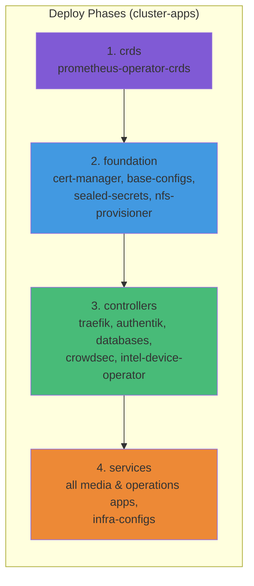
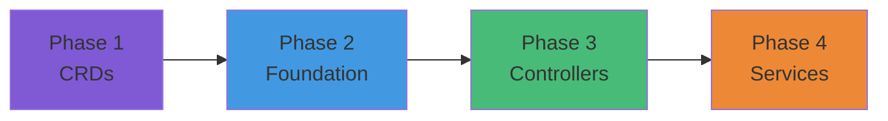

# Homelab Apps


GitOps repository for managing a Kubernetes homelab using ArgoCD with an App-of-Apps pattern. All cluster applications are defined declaratively and automatically synced from this repository.

## Overview

This repository contains the complete application layer for the homelab Kubernetes cluster. It is bootstrapped by [ansible](https://github.com/Starktastic-Homelab/ansible) and uses ArgoCD for continuous deployment.

**37 apps** across 3 categories: 11 infrastructure, 6 operations, 20 media services.

```mermaid
flowchart TB
    subgraph Bootstrap["ArgoCD Bootstrap"]
        ClusterBootstrap[cluster-bootstrap] --> Foundation
        ClusterBootstrap --> InfraConfigs
        ClusterBootstrap --> AppSet
    end
    
    subgraph Apps["Applications"]
        Foundation[foundation<br/>phase: crds/foundation] --> Namespaces[Namespaces]
        AppSet[cluster-apps AppSet<br/>phase: controllers/services] --> Controllers
        AppSet --> Services
        InfraConfigs[infra-configs<br/>phase: services] --> Ingresses
        
        subgraph Controllers["Infrastructure"]
            Traefik[Traefik]
            Authentik[Authentik]
            PostgreSQL[PostgreSQL]
            Redis[Redis]
            CrowdSec[CrowdSec]
        end
        
        subgraph Services["Services"]
            Media[Media Apps]
            Operations[Operations]
        end
        
        subgraph Ingresses["Configs"]
            Routes[IngressRoutes]
            Certs[Certificates]
            MW[Middlewares]
        end
    end
    
    style Bootstrap fill:#2d3748,stroke:#805ad5
    style Apps fill:#2d3748,stroke:#48bb78
```



## Features

- 🔄 **GitOps with ArgoCD** - Declarative app definitions, auto-sync, self-healing
- 📦 **App-of-Apps Pattern** - Unified ApplicationSet for all workloads
- 🔐 **Authentik SSO** - OIDC authentication with ForwardAuth middleware
- 🌐 **Traefik Ingress** - Dynamic IngressRoute generation
- 🔑 **Sealed Secrets** - Encrypted secrets stored in Git
- 🛡️ **CrowdSec** - Intrusion detection with Traefik bouncer
- 🎮 **Intel GPU Support** - SR-IOV passthrough for transcoding
- 💾 **NFS Storage** - Dynamic provisioning with `nfs-pv` StorageClass
- 📊 **Full Observability** - Prometheus, Grafana, Loki, Tempo, Alloy
- � **ArgoCD Notifications** - Sync failure & health alerts via ntfy
- �🔄 **Renovate Managed** - Automated Helm chart updates

## Architecture

```mermaid
flowchart LR
    subgraph External["External Traffic"]
        Public["*.starktastic.net<br/>10.9.8.90"]
        Media["*.benplus.app<br/>10.9.8.90"]
    end
    
    subgraph Internal["Internal Traffic"]
        Int["*.internal.starktastic.net<br/>10.9.9.90"]
    end
    
    subgraph Cluster["K3s Cluster"]
        Traefik[Traefik]
        CrowdSec[CrowdSec<br/>Bouncer]
        Authentik[Authentik<br/>ForwardAuth]
        Apps[Applications]
    end
    
    Public --> Traefik
    Media --> Traefik
    Int --> Traefik
    Traefik --> CrowdSec
    CrowdSec --> Authentik
    Authentik --> Apps
    Traefik --> Apps
    
    style External fill:#e53e3e,stroke:#c53030
    style Internal fill:#4299e1,stroke:#2b6cb0
    style Cluster fill:#2d3748,stroke:#48bb78
```



## Repository Structure

```
bootstrap/                          # Entry point — deploy these first
└── appsets/
    ├── cluster-apps.yaml           # Main ApplicationSet (matrix generator)
    └── config-apps.yaml            # Config ApplicationSet (base-configs + ingresses)

infrastructure/
├── base-configs/                   # Non-Helm cluster configs
│   └── templates/                  # Cert backup CronJob
├── configs/                        # IngressRoutes, certificates, middlewares
│   └── templates/
│       ├── argocd/                 # ArgoCD notifications (ntfy transport)
│       ├── authentik/              # ForwardAuth middleware
│       ├── crowdsec/               # Bouncer middleware
│       ├── databases/              # Database ingress routes
│       ├── hooks/                  # Sync hooks (webhook readiness)
│       ├── media-storage/          # Shared media PV/PVC
│       └── traefik/                # Traefik ingress routes & certs
├── controllers/                    # Helm-based infrastructure
│   ├── authentik/                  # Identity provider & SSO
│   ├── traefik/                    # Ingress controller
│   └── databases/
│       ├── pgadmin/                # Database admin UI
│       ├── postgres/               # PostgreSQL
│       └── redis/                  # Redis cache
└── system/                         # Cluster-level components
    ├── cert-manager/               # TLS certificate automation
    ├── crowdsec/                   # Intrusion detection & bouncer
    ├── intel-device-operator/      # Intel GPU SR-IOV operator
    ├── nfs-provisioner/            # Dynamic NFS volume provisioning
    ├── prometheus-operator-crds/   # Monitoring CRDs (deploy phase: crds)
    └── sealed-secrets/             # Encrypted secrets in Git

services/
├── media/                          # 20 media apps (namespace: media)
│   ├── autobrr/                    # Torrent automation
│   ├── bazarr/                     # Subtitle management
│   ├── cross-seed/                 # Cross-seeding
│   ├── flaresolverr/               # Cloudflare bypass proxy
│   ├── jellyfin/                   # Media server (+ LDAP sync CronJob)
│   ├── lingarr/                    # Subtitle translation
│   ├── prowlarr/                   # Indexer manager
│   ├── qbit-manage/                # qBittorrent tag manager
│   ├── qbit-manage-ru/             # ↳ Russian variant (baseApp)
│   ├── qbittorrent/                # BitTorrent client
│   ├── qbittorrent-ru/             # ↳ Russian variant (baseApp)
│   ├── radarr/                     # Movie management
│   ├── radarr-ru/                  # ↳ Russian variant (baseApp)
│   ├── recyclarr/                  # TRaSH guide sync
│   ├── seerr/                      # Request management
│   ├── seerr-ru/                   # ↳ Russian variant (baseApp)
│   ├── sonarr/                     # TV management
│   ├── sonarr-ru/                  # ↳ Russian variant (baseApp)
│   ├── subgen/                     # AI subtitle generation
│   └── unpackerr/                  # Archive extraction
└── operations/                     # 6 ops apps (namespace: monitoring/operations)
    ├── alertmanager-ntfy/          # Alert → ntfy adapter
    ├── alloy/                      # Grafana Alloy (log/metric collector)
    ├── kube-prometheus-stack/       # Prometheus + Grafana + AlertManager
    ├── loki/                       # Log aggregation
    ├── ntfy/                       # Push notifications
    └── tempo/                      # Distributed tracing

templates/
├── globals.yaml                    # Cluster-wide values (domains, IPs, storage)
├── common.yaml                     # Shared defaults for all services
├── infra-common.yaml               # Infrastructure values (placeholder)
└── ingress-chart/                  # Dynamic IngressRoute generator template

scripts/
├── get-kubeconfig.sh               # Fetch kubeconfig from cluster via SSH
├── new-service.sh                  # Scaffold a new service interactively
├── ntfy-manager.sh                 # Manage ntfy users/access in-cluster
├── seal.sh                         # Seal secrets with kubeseal
└── sealed-secrets-cert.pem         # Sealed Secrets public cert
```

## Deployment Architecture

ArgoCD deploys all apps via two ApplicationSets with a **RollingSync** strategy:



| Phase | Label | Components |
|-------|-------|------------|
| 1 | `crds` | prometheus-operator-crds |
| 2 | `foundation` | cert-manager, base-configs, sealed-secrets, nfs-provisioner |
| 3 | `controllers` | traefik, authentik, databases, crowdsec, intel-device-operator |
| 4 | `services` | All 20 media apps + 6 operations apps, infra-configs |

### Bootstrap Order

Deployment follows strict phase ordering:



## Infrastructure Components

### Controllers

| Component | Chart | Version | Description |
|-----------|-------|---------|-------------|
| Traefik | traefik | 39.0.2 | Ingress controller with dual entrypoints |
| Authentik | authentik | 2026.2.0 | Identity provider with OIDC SSO |
| PostgreSQL | postgresql | 18.4.1 | Database for Authentik and apps |
| Redis | redis | 25.3.2 | Cache for Authentik |
| pgAdmin | pgadmin4 | 1.59.0 | Database administration UI |

### System

| Component | Chart | Version | Description |
|-----------|-------|---------|-------------|
| cert-manager | cert-manager | v1.19.4 | TLS certificate automation (Let's Encrypt) |
| CrowdSec | crowdsec | 0.22.0 | Intrusion detection + Traefik bouncer |
| Intel GPU Operator | intel-device-plugins-operator | 0.35.0 | SR-IOV GPU sharing (20 pods/VF) |
| NFS Provisioner | nfs-subdir-external-provisioner | 4.0.18 | Dynamic NFS PV provisioning |
| Prometheus CRDs | prometheus-operator-crds | 27.0.0 | ServiceMonitor/PodMonitor CRDs |
| Sealed Secrets | sealed-secrets | 2.18.1 | Encrypt secrets for Git storage |

### Operations / Monitoring

| Component | Chart | Version | Description |
|-----------|-------|---------|-------------|
| kube-prometheus-stack | kube-prometheus-stack | 82.4.0 | Prometheus + Grafana + AlertManager |
| Loki | loki | 6.53.0 | Log aggregation |
| Alloy | alloy | 1.6.0 | Grafana Alloy (log/trace/metric collector) |
| Tempo | tempo | 1.24.4 | Distributed tracing |
| alertmanager-ntfy | app-template | 4.6.2 | AlertManager → ntfy webhook adapter |
| ntfy | app-template | 4.6.2 | Self-hosted push notifications |

## Domain & Network Configuration

| Domain | Purpose | LoadBalancer IP | Entrypoint |
|--------|---------|-----------------|------------|
| `*.starktastic.net` | Public services | `10.9.8.90` | `websecure` |
| `*.internal.starktastic.net` | Internal services | `10.9.9.90` | `websec-int` |
| `*.benplus.app` | Media services | `10.9.8.90` | `websecure` |

| Resource | IP / CIDR | Purpose |
|----------|-----------|---------|
| NFS Server | `10.9.8.30` | Persistent storage |
| qBittorrent | `10.9.8.91` | BitTorrent LB |
| qBittorrent-RU | `10.9.8.92` | BitTorrent LB (RU) |
| Management VLAN | `10.9.9.0/24` | Cluster management |
| Services VLAN | `10.9.8.0/24` | Service network |
| WireGuard VLAN | `10.9.10.0/24` | VPN network |

## Usage

### Adding a New Service

Use the interactive scaffolding script:

```bash
./scripts/new-service.sh
```

Or manually create `services/<category>/<name>/` with:

**app.yaml**:
```yaml
name: my-service
namespace: my-namespace

ingress:
  enabled: true
  host: my-service
  domainType: "internal"    # public | internal | media
  port: 8080
  auth: true                # Authentik ForwardAuth
  rateLimit: true           # CrowdSec rate limiting
```

**values.yaml** — extends `templates/common.yaml` (inherits TZ, PUID/PGID, probes, NFS config).

**manifests/** — plain Kubernetes manifests (PVCs, Secrets, ConfigMaps).

### Sealing Secrets

```bash
# Namespace-scoped (default)
./scripts/seal.sh <secret-name> <namespace>

# Cluster-wide scope
./scripts/seal.sh <secret-name> <namespace> --cluster-wide
```

### GPU Support

Intel GPU SR-IOV passthrough for hardware transcoding (20 pods share each VF):

```yaml
controllers:
  main:
    containers:
      main:
        resources:
          requests:
            gpu.intel.com/i915: "1"
          limits:
            gpu.intel.com/i915: "1"
```

## Pipeline Integration

```mermaid
flowchart TD
    Packer["📦 Packer\nVM Template"] -->|manifest.json| Terraform
    Terraform["🏗️ Terraform\nVM Provisioning"] -->|dispatch| Ansible
    Ansible["⚙️ Ansible\nK3s Cluster"] -->|bootstrap| Apps
    Apps["🚀 Apps\nGitOps Deployment"]

    style Packer fill:#4299e1,stroke:#2b6cb0
    style Terraform fill:#805ad5,stroke:#553c9a
    style Ansible fill:#48bb78,stroke:#276749
    style Apps fill:#ed8936,stroke:#c05621
```



## Troubleshooting

| Issue | Solution |
|-------|----------|
| PostgreSQL postmaster.pid lock | Init container auto-removes stale locks |
| Sealed secrets decryption error | Verify secret was sealed for correct namespace |
| PVC stuck in Pending | Verify NFS server `10.9.8.30` is accessible |
| GPU not available | Check intel-gpu-plugin pods are running |
| CrowdSec bouncer blocking | Check `cscli decisions list` in LAPI pod |

## Related Repositories

| Repository | Description |
|------------|-------------|
| [packer](https://github.com/Starktastic-Homelab/packer) | Builds Debian VM templates for Proxmox |
| [terraform](https://github.com/Starktastic-Homelab/terraform) | Provisions VMs on Proxmox |
| [ansible](https://github.com/Starktastic-Homelab/ansible) | K3s cluster bootstrap & configuration |

## License

MIT
