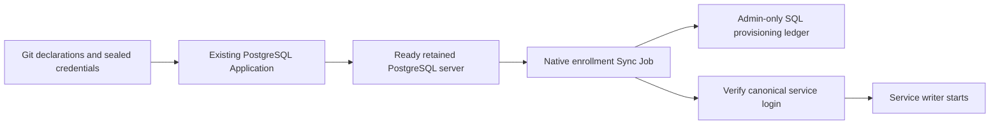

# PostgreSQL application enrollment on the existing server

Status: approved for inactive source and synthetic local Docker qualification.
External lab allocation and production activation require separate exact approval.

## Intent and decisions carried forward

Replace manual database/user/password setup with declarative service enrollment.
Keep the existing digest-pinned PostgreSQL deployment after the
[stock CNPG qualification failed](../reports/2026-10-10-cnpg-qualification-results.md).
Keep compute and Kubernetes metadata disposable: the database disk, sealed
credentials and Git declarations must support the normal rebuild without a
backup checkpoint. This work does not replace PostgreSQL, change its major,
convert application data or move its current NFS directory to CSI.

The design adds one rerunnable native Argo Sync Job and a small admin-only SQL
enrollment ledger. It adds no operator, CRD, password-reflection controller or
Terraform enrollment logic. The ledger is proposed persistent SQL state, requiring
user approval; it is not Kubernetes metadata or an external service inventory.

## Verified baseline

Read-only observation on 2026-10-10, after PR1321 merged at
`a2b81015a584971bf21a4f1fd394ac79243d3474`:

- Server PostgreSQL18.6, system identifier `7584099661242523698`, Ready primary
  `databases/postgres-postgresql-0`. Server digest agrees with Git's existing pin.
- Existing application databases/owners: authentik/authentik,
  dispatcharr/dispatch, lingarr/lingarr, listmonk/listmonk, mealie/mealie,
  paperless/paperless, vaultwarden/vaultwarden and vikunja/vikunja.
- These application roles permit login and have no superuser, createdb,
  createrole, replication or bypass-RLS attribute. Role memberships, schema/table
  ownership, default privileges and complete application dependencies still need
  inventory before any existing-role adoption.
- Listmonk has pgcrypto1.4; Mealie has pg_trgm1.6; all databases have plpgsql1.0.
  Extensions are inventoried, not automatically installed or upgraded by enrollment.
- Database ACLs were null. This is the default ACL, not evidence of strict
  cross-database CONNECT isolation. Preserve legacy privileges during initial rollout.
- Chart18.12.4 uses `postgres-admin-secret`, an 8Gi NFS claim, a sealed admin
  credential and an existing same-NAS daily backup. No credentials were exported
  by this inventory; the Pod consumed its existing password locally.

See [sanitized catalog evidence](../reports/evidence/2026-10-10-postgresql-enrollment-inventory.json).
Client connections were a point-in-time observation; Listmonk's absence from the
connection sample does not prove it unused. No SQL writes were made.

## Onboarding contract

A service declares a stable enrollment ID, exact database name, exact login role,
mode (`new` or explicitly approved `adopt`) and canonical credential key. One
role/database pair per enrollment; duplicate identities, reserved roles/databases,
unexpected identifier encodings and incompatible attributes are rejected before
writes. Registry identifiers and SQL identifiers are quoted correctly, never
interpolated as raw SQL or shell fragments.

The onboarding helper generates a strong password once outside Kubernetes and
seals it using `scripts/seal.sh`: one key in the database-namespace enrollment
Secret and the necessary application-namespace Secret keys/URL. The same password
is used in both. Git contains ciphertext and non-secret declarations. Rebuilds and
Job retries never generate a password. Existing credentials are adopted from the
verified current application value, not replaced with random values.

Proposed source layout extends the current postgres Application's raw manifests
with one ConfigMap (declarations and common enrollment script), one native Job and
one sealed aggregate enrollment Secret. The Job mounts that Secret and the
existing admin Secret in `databases`; it does not read Secrets through the API,
receive a service-account token or pass admin credentials to application Pods.
A local helper prepares encrypted inputs and native manifest changes; it is not
required during rebuilds. Preserve existing ApplicationSet sources/value layers.

Removing an enrollment declaration retains SQL roles, databases and their contents.
Deletion, renaming, ownership transfer, extension changes and privilege elevation
are separate explicit operations. Enrollment does not restore lost application data.

## Durable provisioning state

Use one small table in a reserved admin-owned schema in the existing `postgres`
maintenance database. Store only stable enrollment ID, database, role, mode and
phase (`provisioning` or `ready`). Unique ID/database/role constraints prevent two
entries claiming the same identity. No passwords or password hashes are stored
in this table. PUBLIC and application roles receive no schema/table privileges.

Pin the expected PostgreSQL system identifier in the non-secret deployment
configuration. Check it before any enrollment write. It stays stable when the
same physical data directory survives a rebuild; logical restore to another
cluster requires an explicitly reviewed identity change.

Create the registry only during the explicitly approved one-time installation.
Normal desired state requires its existing schema/table and compatible structure;
missing/corrupt registry or wrong server identity fails closed. Do not infer a new
registry from fresh Kubernetes metadata or use unconditional CREATE IF NOT EXISTS.
The initial registry setup is followed by final Git state with bootstrap disabled.

Under a bounded PostgreSQL session advisory lock, process each declaration:

| Observation | Action |
|---|---|
| Unknown `new` enrollment; role and database both absent | Atomically record `provisioning` and create a restricted NOLOGIN role; assign canonical password, create database with that owner, establish privileges, then atomically mark `ready` and enable LOGIN |
| Known `provisioning` enrollment | Resume only the exact recorded identities and canonical credential; reject conflicting objects; complete first-time creation before enabling LOGIN |
| Known `ready` enrollment | Require the database and role to exist; verify ownership, expected restrictions and canonical application authentication; preserve data and password |
| Unknown explicitly approved `adopt` enrollment | Require both objects to exist; validate catalog and canonical login, then record `ready`; do not reset existing attributes/grants or ownership |
| Missing established database/role, mismatched identity or incompatible ownership | Fail before modification; never manufacture a replacement empty database |
| Removed declaration | Leave existing SQL state untouched |

`CREATE DATABASE` cannot run inside a transaction. The durable provisioning phase
bridges that boundary. New roles cannot log in until the completion marker is
committed, so retries can safely finish an unexposed initial database. Existing
application roles enter only through the adopt path, which never creates missing
objects. Registry/catalog checks must also detect tampered or inconsistent phases.
Other SQL administrators are outside the advisory lock contract: conflicts cause
failure rather than automatic takeover.

Client authentication is an acceptance check, not pg_isready alone. Preserve the
canonical password for ready/adopted enrollments; mismatch is an error. Password
rotation is an explicit coordinated operation with client restart/reload, not a
side effect of every sync. Password assignment must use client-side SCRAM hashing
or PostgreSQL's native psql password mechanism to avoid plaintext statement logs.
Its noninteractive behavior and interrupted NOLOGIN setup require qualification.

The ready ledger phase means server-side provisioning has committed. Native login
verification runs after that same commit enables LOGIN: a NOLOGIN role cannot
perform the authentication check earlier. If the authentication child then fails,
the Job fails while ready/LOGIN and the completed database remain intact. A retry
verifies the canonical credential without reset/recreation. Schema/setup child
failure occurs before that commit and retains provisioning/NOLOGIN. Therefore a
new writer must wait for successful Job/acceptance completion, not merely LOGIN
or the ready ledger row. This ordering exception resolves the implementation
plan's broader child-failure wording; it must pass the native writer-gating lab
before any activation.

For new databases, restrict PUBLIC database/schema privileges and grant only the
owner's required rights. Verify both connection and actual object-access denial
between enrolled services. This does not tighten legacy database ACLs silently;
full server-wide isolation is a separately reviewed change. Applications own their
schema migrations, including default privileges for objects they create.

## Argo ordering and runtime behavior

The existing postgres Application owns enrollment along with the database chart.
Sealed declarations and script ConfigMap are in an earlier Sync wave; the server
and its ordinary resources are at wave0; a named **Sync** Job runs at wave1 after
the server is Healthy. Use BeforeHookCreation and HookSucceeded cleanup, preserving
failed-job evidence. Do not use PreSync: on a cold rebuild neither the same-app
Secrets nor the server would have been applied yet.

The Job has bounded connection/lock waits, retries and an overall deadline. It
uses a digest-pinned compatible native PostgreSQL client, no install-at-startup
packages, no CSI mount and no server restart. A new sync safely replaces an old
hook only because transactions and the durable provisioning phase survive client
interruption. Missing Secret projection prevents the Job from running; it cannot
fall back to a generated password. Application startup waits for its verified
canonical database login when dependency ordering alone is insufficient.

RollingSync is a coarse group ordering mechanism, not a SQL completion guarantee.
Verify the installed Argo version's hook/failure behavior. Controllers such as
Authentik share the postgres rollout group and cannot rely on within-group order.
Keep existing clients unchanged until their own adoption is qualified. For a new
service, require enrollment success before its writer rollout and verify that a
failed Job cannot let that writer initialize another backend or database.

Hooks do not run during selective sync; enrollment changes require full postgres
Application sync. Secret-only changes are not promised to continuously reconcile
SQL. No CronJob or drift-repair operator is added. Errors use existing Argo sync
notifications and sanitized logs identifying the enrollment and failed check;
no password-bearing SQL, environment dump or client URL enters logs.

## Qualification and rollout boundaries

Before production activation, use synthetic disposable PostgreSQL with the same
major and relevant authentication policy. Prove new enrollment, exact retries,
conflicting IDs/objects, adopt without data/password changes, declaration deletion
retention, password special characters and absence of plaintext secret logs.
Inject process/connection interruption before and after every durable boundary,
including role creation, password assignment, database creation and ready/LOGIN
commit. Concurrent hooks must serialize; missing ready-state data, registry,
credentials and wrong system identifier must stop without replacement objects.

Exercise the installed Argo/Sealed Secrets flow: blank initial lab setup, recovered
canonical credentials, full sync, failed/blocked hook, retry, selective-sync
limitation and hook deletion. Prove no application writer starts before successful
enrollment, including a controller-phase consumer. Replace disposable cluster
metadata/compute without touching the PostgreSQL disk and verify the same system
identifier, registry, newest sentinel rows and canonical credentials. These are
acceptance requirements, not completed test claims.

Roll out one synthetic enrollment first, then prepare Autobrr enrollment for its
separate converter rehearsal. Adopt existing manual enrollments one at a time
after complete privilege/credential inventory and application checks. Capture
Listmonk/Mealie extension requirements for the later PostgreSQL CSI plan.

The later PostgreSQL CSI cutover must independently qualify exact static retained
binding, single-writer fencing, PGDATA validation before Bitnami initialization,
replacement of the unconditional postmaster.pid deletion, growth, cold physical
copy at the same major and an off-NAS backup restore. Enrollment cannot make a
wrong/missing database disk safe and does not authorize that cutover.

## Sources and design limits

- [Argo sync phases and waves](https://argo-cd.readthedocs.io/en/stable/user-guide/sync-waves/): Sync-wave ordering, hook cleanup and selective-sync limitation.
- [RollingSync](https://argo-cd.readthedocs.io/en/stable/operator-manual/applicationset/Progressive-Syncs/): health-based group sequencing and hook support; exact installed behavior remains a lab gate.
- [PostgreSQL CREATE DATABASE](https://www.postgresql.org/docs/18/sql-createdatabase.html): ownership and transaction restriction.
- [PostgreSQL psql](https://www.postgresql.org/docs/18/app-psql.html): safe variable quoting, error handling and native client-side password hashing.
- [PostgreSQL REVOKE](https://www.postgresql.org/docs/18/sql-revoke.html): PUBLIC and owner privilege semantics.

The ledger and failure rules are this design's policy, not a standard PostgreSQL
operator feature. Local engine qualification is recorded separately; native Argo
and retained-disk rebuild qualification remain required before production activation.
